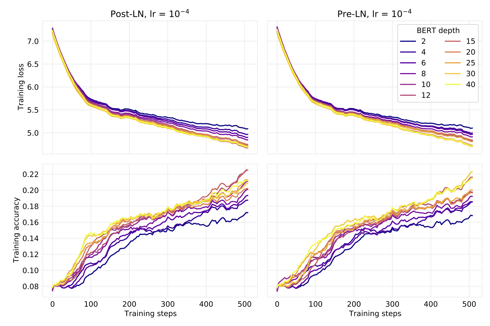
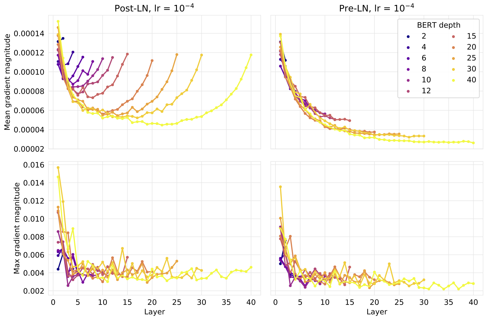
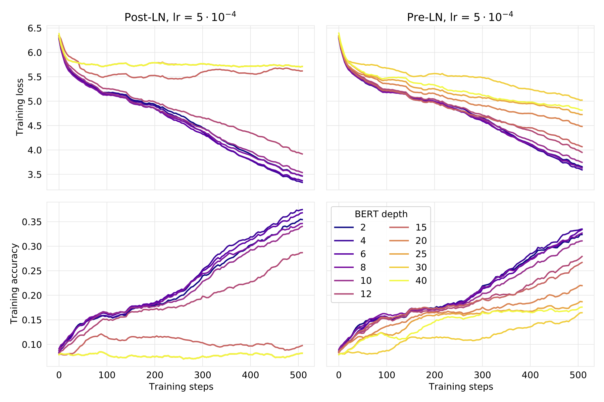
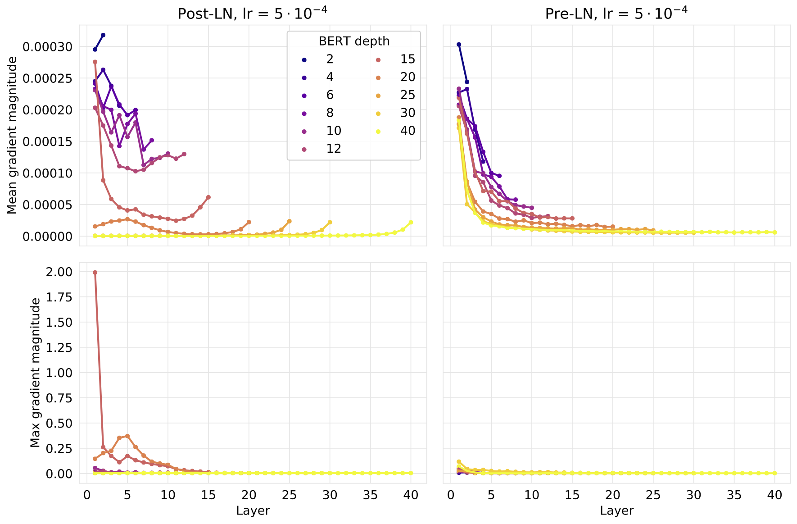
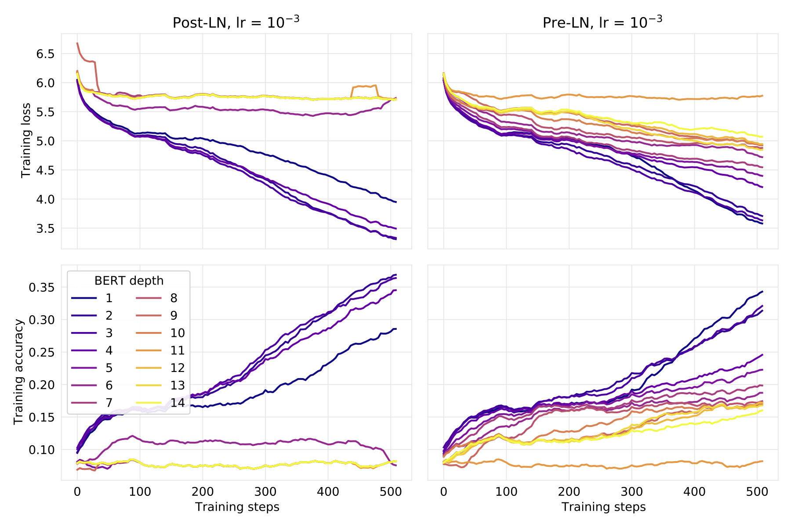
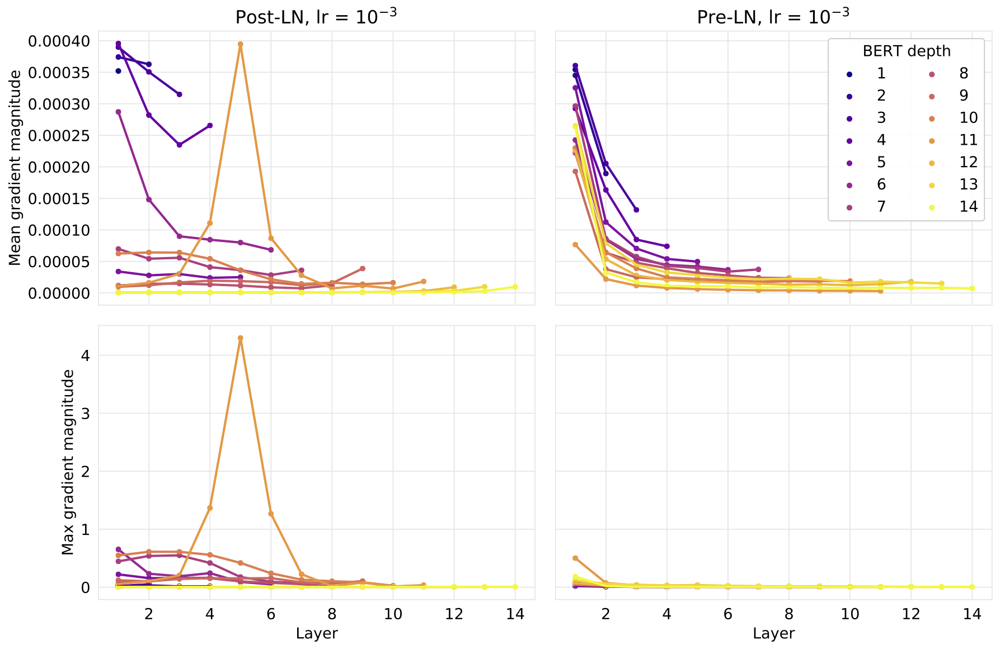

# On Layer Norm in Transformers

This notebook compares the impact of positioning the layer norm differently in BERT as explained in

[On Layer Normalization in the Transformer Architecture](http://proceedings.mlr.press/v119/xiong20b/xiong20b.pdf)

BERT is trained on masked language modeling, with a small dataset consisting of about 8000 training sentences from German weather forecasts ([PHOENIX-2014T](https://www-i6.informatik.rwth-aachen.de/~koller/RWTH-PHOENIX-2014-T/)).

Results for different learning rates are below.

## LR = 1e-4

## LR = 5e-4

## LR = 1e-3

